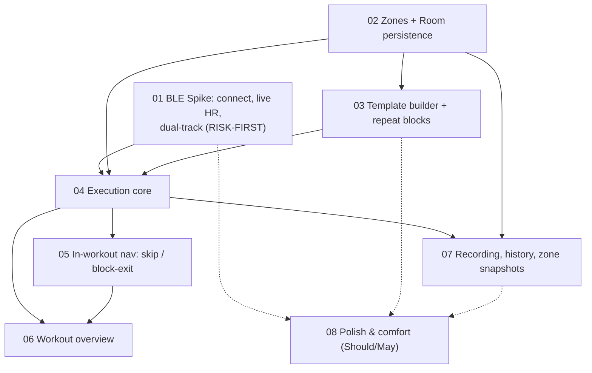

# Polar-Phases — Vertical-Slice Plan: Overview

This document breaks [`docs/requirements-spec.md`](../requirements-spec.md) into **vertical,
end-to-end slices**. Each slice is individually buildable in Android Studio, testable, and
demonstrable on a real device with a Polar H10 — not a horizontal layer (no "all the data
models" slice, no "all the UI" slice).

**Driving constraint:** front-load the risky BLE assumption. Whether the new app *and* Polar
Beat can both receive live HR from one H10 on one phone (F-1.6 / F-1.7, spec §8) is the
make-or-break unknown. It is proven or disproven in **Slice 01**, before any UI is built on
top of it, so a failure reshapes the plan early instead of after three UI slices.

Scope of this planning step: **markdown only**. No Gradle project and no Kotlin yet.

---

## Slice dependency graph

- **BLE live HR (F-1.1, F-1.2)** is the root of everything that shows a real heartbeat:
  execution (F-4.2), out-of-zone warnings (F-4.5), the HR time series (F-5.1), reconnection
  robustness (N-6, F-1.4).
- **Dual tracking (F-1.6, F-1.7)** depends on F-1.2 and is the highest-risk unknown — proven
  on a real device with Polar Beat in Slice 01 (spec §8).
- **Zones (F-2.1, F-2.3)** are referenced by **phases (F-3.2)** → templates depend on zones.
- **Templates (F-3.x)** depend on zones and on Room. The flat "phases + non-nested repeat
  blocks" data model (F-3.2b) drives both execution and the overview, so the schema is settled
  early (Slice 03).
- **Execution (F-4.x)** depends on a saved template (F-3.x) + zones (F-2.x) + live HR (F-1.x).
- **Recording & history (F-5.1)** depends on execution producing data. **Zone snapshot (F-2.4)
  + immutability (F-2.5)** only become meaningful once a session is saved → they live with
  recording (Slice 07), not with zone CRUD.
- **N-6 (Must)** lands *with* execution (an active workout must not abort). Richer reconnect
  UI (F-1.4) and startup auto-reconnect (F-1.3), both Should, are polish.
- **Room (N-2/N-3)** is introduced in the first slice that stores data (zones, Slice 02).

---

## Slice sequence

| #  | Slice | Type |
|----|-------|------|
| 01 | BLE Spike: Connect, Live HR, Dual Tracking | **Risk-first** |
| 02 | Zone Management + Persistence Foundation | Must core |
| 03 | Template Builder with Repeat Blocks | Must core |
| 04 | Workout Execution Core | Must core |
| 05 | In-Workout Navigation: Skip & Block Exit | Must core |
| 06 | Workout Overview | Must core |
| 07 | Recording & History + Zone Snapshots | Must core (+Should) |
| 08 | Polish & Comfort | Polish (Should/May only) |

All **Must** requirements are covered in slices 01–07. No Must is deferred to Polish.
F-2.4 / F-2.5 (Must) sit in Slice 07 — a justified deferral (only meaningful once a session is
saved), not a gap.

---

## Requirement → slice traceability matrix

Every requirement ID from the spec, its priority, and the single slice that **owns** it.
Cross-cutting NFRs are counted once at their primary owner; later re-mentions are refinements,
not second owners (see notes).

### Sensor Connection (F-1.x)

| ID | Priority | Owner | Notes |
|----|----------|-------|-------|
| F-1.1 | Must | 01 | Scan + device list |
| F-1.2 | Must | 01 | Connect via HR Service, receive bpm |
| F-1.3 | Should | 08 | Auto-reconnect on startup — polish |
| F-1.4 | Should | 08 | Reconnect status UI during workout — polish (N-6 covers the *robustness*) |
| F-1.5 | May | 08 | Battery/signal display — polish |
| F-1.6 | Must | 01 | Dual tracking — **risk-first**; see kill-criterion in `01` |
| F-1.7 | Should | 01 | Clear error if H10 connection can't be established |

### Zone Management (F-2.x)

| ID | Priority | Owner | Notes |
|----|----------|-------|-------|
| F-2.1 | Must | 02 | Zone CRUD (name, color, bpm min/max) |
| F-2.2 | Should | 02 | Karvonen helper — cheap, seeds realistic test zones |
| F-2.3 | Must | 02 | Zones global, not per-workout |
| F-2.4 | Must | 07 | Immutable zone snapshot on session save — only meaningful at save time |
| F-2.5 | Must | 07 | Zone edits don't alter saved sessions — pairs with F-2.4 |

### Workout Templates (F-3.x)

| ID | Priority | Owner | Notes |
|----|----------|-------|-------|
| F-3.1 | Must | 03 | Template with any number of phases |
| F-3.2 | Must | 03 | Phase = name, duration, target zone |
| F-3.2a | Must | 03 | Repeat block: ≥2 phases + fixed count |
| F-3.2b | Must | 03 | Flat one-level model, no nesting — drives 04/05/06 |
| F-3.2c | Must | 03 | Example structure is buildable |
| F-3.3 | Should | 08 | Reorder phases — polish |
| F-3.4 | Should | 08 | Duplicate templates — polish |
| F-3.5 | Must | 03 | Persistent across app + device restart |
| F-3.6 | Must | 03 | Rename / delete templates |

### Workout Execution (F-4.x)

| ID | Priority | Owner | Notes |
|----|----------|-------|-------|
| F-4.1 | Must | 04 | Select + start template |
| F-4.2 | Must | 04 | Live HR, phase name, remaining time, target zone |
| F-4.2a | Must | 04 | "Repetition 3 of 6" inside a block |
| F-4.3 | Must | 04 | Auto phase transition on timeout |
| F-4.4 | Must | 04 | Vibration/sound feedback on transition |
| F-4.5 | Must | 04 | Unobtrusive out-of-zone warning |
| F-4.6 | Must | 04 | Pause / resume / end early |
| F-4.7 | Must | 05 | Skip current phase |
| F-4.7a | Must | 05 | Exit entire remaining block; both controls separately selectable |
| F-4.8 | Must | 04 | Screen stays on |
| F-4.9 | Must | 06 | Workout overview (detail in 4.4.1) |
| F-4.9a | Must | 06 | Overall progress bar |
| F-4.9b | Must | 06 | Expandable chronological list |
| F-4.9c | Must | 06 | Active highlighted, done/open marked |
| F-4.9d | Must | 06 | Block as one consolidated, expandable entry |
| F-4.9e | Must | 06 | Accessible without disturbing the timer |

### Recording and History (F-5.x)

| ID | Priority | Owner | Notes |
|----|----------|-------|-------|
| F-5.1 | Must | 07 | Save date, template, phase sequence, HR time series |
| F-5.2 | Should | 07 | List of past workouts |
| F-5.3 | Should | 07 | Simple HR graph (zone-colored bg) — drop to 08 if not cheap |
| F-5.4 | May | 08 | CSV export — polish |
| F-5.5 | Should | 07 | Note early exits ("4 of 6 reps") |

### Non-Functional (N-x)

| ID | Priority | Owner | Notes |
|----|----------|-------|-------|
| N-1 | Must | 01 | Native Android / Kotlin — app skeleton stands up here |
| N-2 | Must | 02 | Local-only storage — established with Room |
| N-3 | Must | 02 | **Cross-cutting**: fully offline. Primary owner 02; validated throughout (also true in 01) |
| N-4 | Should | 04 | Readable at 1–2 m. Primary owner 04; **refined** (not re-covered) in 08 |
| N-5 | Should | 01 | HR-update→display < 1 s. Primary owner 01 (first live bpm); re-validated in 04 |
| N-6 | Must | 04 | Robust against brief BLE drops — lands with execution |
| N-7 | Should | 06 | Overview performant with many phases. Primary owner 06; **refined** in 08 |

**Coverage summary:** 49 IDs (F-1.x ×7, F-2.x ×5, F-3.x ×9, F-4.x ×16, F-5.x ×5, N-x ×7).
Each maps to exactly one primary slice. Every Must is in 01–07; Slice 08 holds only
Should/May. N-3/N-4/N-5/N-7 re-mentions in later slices are validation/refinement, not a
second owner.

---

## Gaps / contradictions to resolve (and where)

1. **Dual-tracking topology (F-1.6, §8).** The hard unknown is whether *two apps on one
   Android phone* can each hold an independent GATT connection to one H10 — not the H10's
   ~2-central count. Resolved first in **Slice 01**, with a recorded fallback if it fails.
2. **Progress-bar "total" under skip / early-exit (F-4.9a vs F-4.7/F-4.7a).** When a block is
   exited early, planned total duration/phase count changes. Decide whether the bar tracks the
   *planned* total or *recomputes* live — decided in **Slice 06**.
3. **History graph scope (§8, F-5.3 Should).** Kept deliberately simple for V1 (time vs bpm,
   zone-colored background) in **Slice 07**.
4. **Overview visibility (§8, F-4.9).** Progress bar always-on vs on-demand — decided in
   **Slice 06**.
5. **Initial default zones (§8).** Adopt resting 62 / HRmax 179 as proposed — decided in
   **Slice 02**.
6. **HR recording during pause.** Spec is silent on whether the HR time series keeps recording
   while paused — minor, decided in **Slice 04**.

### Reconciliation notes (coverage decisions worth auditing)

- **N-3 (offline)** is cross-cutting; listed once with primary owner Slice 02, validated
  everywhere — not double-counted in Slice 01.
- **N-5 (HR latency)** owned by Slice 01 (first point a live bpm is rendered, where latency is
  first measurable), re-validated in Slice 04. No dangling "partial".
- **N-4 / N-7** owned by their early slice (04 / 06); Slice 08 entries are explicit refinement,
  not new coverage.
- **F-1.7** is `Should` (not Must); it stays in Slice 01 because the error-on-connect path
  belongs with the connection spike.
